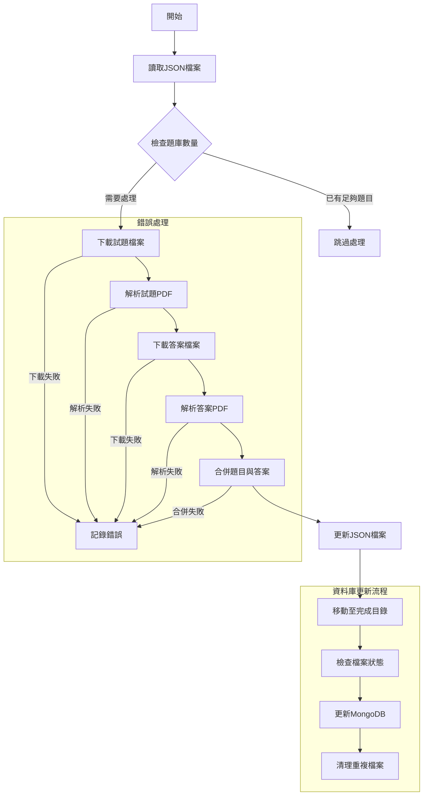

# 台灣國家考試題庫解析系統

## 目錄
- [專案簡介](#專案簡介)
- [系統需求](#系統需求)
- [安裝說明](#安裝說明)
- [使用方法](#使用方法)
- [API 文件](#api-文件)
- [測試說明](#測試說明)
- [貢獻指南](#貢獻指南)
- [授權條款](#授權條款)
- [聯絡資訊](#聯絡資訊)
- [版本更新記錄](#版本更新記錄)

## 專案簡介
本專案旨在建立一個自動化的台灣國家考試題庫解析系統，主要功能包括：
- 使用 Google Gemini Pro 2.5 進行題目解析
- 將 PDF 格式的考題轉換為結構化的 JSON 格式
- 自動化處理圖片和文字內容
- 整合 MongoDB 資料庫進行資料管理

### 資料來源
- 考選部 考畢試題查詢平臺：https://wwwq.moex.gov.tw/exam/wFrmExamQandASearch.aspx
- 考選部 資料開放專區：https://wwwc.moex.gov.tw/main/content/SubMenu.aspx?menu_id=2251

## 系統需求
- Python 3.x
- MongoDB 資料庫
- Google Gemini Pro 2.5 API 存取權限
- 作業系統：macOS（已測試）或其他支援的作業系統

## 安裝說明

### 1. 安裝 Python 套件
```bash
pip install -r requirements.txt
```

### 2. 安裝系統依賴
#### macOS 用戶
```bash
brew install imagemagick poppler
```

### 3. 環境變數設定
建立 `.env` 文件並設定以下變數：
```
GOOGLE_API_KEY=your_google_api_key
mongo_id={請與Ken連絡，Discord: guoway0716}
mongo_pw={請與Ken連絡，Discord: guoway0716}
```

## 使用方法

### 1. 解析考題
```bash
python .ken/gemini_resolver.py
```

### 2. 更新資料庫
```bash
python update_db.py
```

## API 文件

### gemini_resolver.py
主要功能：解析 PDF 格式的考題和答案，並轉換為結構化的 JSON 格式。

#### Token 使用與記錄
本專案使用 Google Gemini Pro 2.5 和 Gemini 2.0 Flash 模型進行題目解析，相關的 token 使用情況會被詳細記錄在 `logs/generation.log` 中。每個處理步驟都會記錄：
- 輸入 token 數量
- 輸出 token 數量
- 總計 token 數量

例如：
```
Token 使用量 - 輸入: 2105, 輸出: 14522, 總計: 16627
```

這些記錄有助於：
1. 追蹤 LLM 使用成本
2. 優化提示詞設計
3. 監控系統效能
4. 提供使用統計數據

由於本專案為公益性質，LLM 使用費用由 FreeSeed 提供，因此詳細的 token 記錄對於成本控制和資源分配非常重要。

#### 主要函數
1. `resolve_question_from_pdf(file_path: str) -> list[PreMMLUDatasetItem]`
   - 解析題目卷 PDF 檔案
   - 參數：PDF 檔案路徑
   - 回傳：結構化的題目列表

2. `resolve_answer_from_pdf(file_path: str) -> list[PreAnswerItem]`
   - 解析答案卷 PDF 檔案
   - 參數：PDF 檔案路徑
   - 回傳：結構化的答案列表

3. `merge_question_and_answer(questions: list[PreMMLUDatasetItem], answers: list[PreAnswerItem]) -> list[PreMMLUDatasetItem]`
   - 合併題目和答案
   - 參數：題目列表和答案列表
   - 回傳：合併後的完整題目列表

### update_db.py
主要功能：管理資料庫更新和檔案處理。

#### 主要函數
1. `update_mongodb()`
   - 更新 MongoDB 資料庫中已處理檔案的狀態標記
   - 自動將已處理的檔案標記為已解析

2. `move_completed_files_to_done_dir()`
   - 將處理完成的檔案移至完成目錄

3. `remove_duplicate_files_from_question_json_all()`
   - 清理重複檔案

### 流程圖


### 其他重要檔案說明

#### 資料結構定義
- `exam_schema.json`: 定義考題資料的 JSON Schema，用於驗證解析後的考題資料格式
  - 包含題目、選項、答案等欄位的格式規範
  - 確保資料的一致性和完整性

- `MMLU-example.json`: MMLU 格式的考題範例檔案
  - 展示標準化的考題資料結構
  - 作為資料轉換的參考範本

#### 開發工具與輔助檔案
- `work.ipynb`: Jupyter Notebook 開發環境
  - 用於快速測試和驗證程式碼
  - 提供互動式的開發體驗
  - 方便進行資料分析和視覺化

- `util.py`: 通用工具函數集合
  - 提供檔案處理、字串操作等共用功能
  - 包含資料驗證和轉換的輔助函數
  - 簡化主要程式的開發工作


## 測試說明
1. 單元測試
   無

2. 整合測試
   無

## 貢獻指南
1. Fork 本專案
2. 建立新的功能分支
3. 提交變更
4. 發起 Pull Request

## 授權條款
根據著作權法第九條，依法令舉行之各類考試試題及其備用試題不受著作權保護。

## 聯絡資訊
- 作者：Ken
- 電子郵件：[ken@sylksoft.com]
- Discord: guoway0716

## 版本更新記錄
### v1.0.0 (2024-04-11)
- 初始版本發布
- 支援基本考題解析功能
- 整合 MongoDB 資料庫
- 實現自動化檔案管理